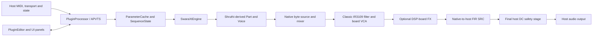

# SWARA XT architecture

This document describes the current implementation. It is a map of the code,
not a claim that the software is circuit-calibrated to a physical instrument.

## Entry points and JUCE integration

`Source/Plugin/PluginProcessor.*` implements the JUCE `AudioProcessor` and
exports `createPluginFilter()`. It owns the APVTS parameter tree,
`ParameterCache`, `SequenceState`, `SwaraXtEngine`, program handling, and host
state serialization. `prepareToPlay()` prepares the engine for the host sample
rate and block size; `processBlock()` clears the host buffer, applies published
state when available, and passes MIDI plus host transport to the engine.

`Source/Plugin/PluginEditor.*` creates the JUCE editor. The editor owns the
skin, size, decoration, and manufacturer-mark preferences; panels bind their
controls to the processor's APVTS. The processor/editor boundary is therefore
APVTS for audio parameters and explicit processor/`SequenceState` APIs for the
sequencer workflow state.

## Major data flow

The Shruthi-native render clock is `20 MHz / 510`; engine transactions use
40 native samples. The engine schedules host MIDI and transport information at
this native boundary, then converts completed instrument output to the host
sample rate.

## Voice and synthesis path

`SwaraXtEngine` owns the production voice path. `PatchBridge` applies the
cached plug-in parameters to the Shruthi-derived patch and system state.
Production uses the adapted Shruthi port and the `avrlib_hd` voice facade in
`Source/Engine/ShruthiPort`; the name does not enable alternate analytic or
oversampled oscillator modes in the shipping Classic path.

The voice provides the original-style oscillator, mixer, sub/noise, envelope,
LFO, modulation-matrix, pitch, timing, and random-state behavior. The source
output is consumed as native byte-derived audio. The dedicated filter ENV and
LFO controls are native patch fields; the modulation matrix remains a separate
12-row routing system.

## Filter, VCA, effects, and output

`Source/Engine/Filter/SwaraXtFilter.*` implements the Classic IR3109-inspired
instrument path, including its board input/output response, reconstructed
control voltages, nonlinear filter core, and VCA behavior. `SwaraXtEngine`
derives the authoritative filter control state from the Shruthi voice and adds
the plug-in's key-tracking extension before it reaches the reconstructed board
control path.

`Source/Engine/DspBoard` contains optional post-filter DSP-board effects and
their state/tail handling. The shipping route is Classic filter/VCA followed by
the selected DSP-board effect (or Off), not an alternate selectable filter.

`Source/Engine/SampleRate/PolyphaseFirResampler.h` converts the native output
to the host rate. `HostResampler` applies the final host-output DC safety stage
after sample-rate conversion. Dormancy and tail draining in `SwaraXtEngine`
allow voice, filter, effect, SRC, and DC state to settle before exact idle.

## Sequencer and arpeggiator

`SequenceState` stores a bounded 16-step snapshot with revision-based,
atomic publication to the audio thread. `SwaraXtEngine::applyParameters()`
captures a coherent revision and maps it into the Shruthi-derived sequencer
settings. The adapted Shruthi `Part` handles sequencer, arpeggiator, held-note,
and clock behavior. The unified UI exposes sequencer and arpeggiator controls,
sequence randomization, and a workflow lock that can preserve sequence-related
state while loading musical presets.

## Parameters, presets, and state

Parameter IDs and APVTS layout live in
`Source/Plugin/SwaraXtParameterLayout.*`; `ParameterCache` exposes their
audio-thread-facing values. The processor serializes APVTS state together with
sequence and selected workflow metadata, and canonicalizes retired mode fields
when restoring older state.

There are two factory-preset representations. SWARA-authored factory presets
are APVTS parameter records in `ApvtsFactoryPresetData.h`. Forty imported
Shruthi factory patches are stored as 92-byte records in
`ShruthiFactoryPresetData.h` and decoded by `ShruthiFactoryPresets.cpp`.
User preset operations use the processor's complete state serialization.

## UI

`Source/Ui` contains the look-and-feel, panels, board-effects panel, skins,
typography, and resource handling. The editor presents oscillator, LFO, mixer,
filter, envelope, Global/FX, modulation-matrix, and unified Seq/Arp areas.
The Global module swaps its contents in place for FX controls. Skins,
decorations, GUI size, and manufacturer mark are UI preferences rather than
musical APVTS parameters.

## Third-party boundary

The pinned `third_party/shruthi-1` source provides the upstream Shruthi
reference material and nested avrlib components. `Source/Engine/ShruthiPort`
contains the host adaptation and selected adapted sources used by SWARA XT.
The Classic oscillator and voice sources also remain available to parity and
reference tests; they are not evidence that an alternate production renderer
is selectable.

## Build and tests

`CMakeLists.txt` builds the JUCE plug-in and Standalone targets.
`CMakePresets.json` defines release and development presets; development
presets enable the opt-in test tree under `Tests`.

Tests cover source/parity behavior, filters and multirate processing,
presets/state, sequencer workflow, DSP-board behavior, host SRC, dormancy,
multi-instance and GUI synchronization. See [BUILDING.md](../BUILDING.md) for
the supported build commands.

## Real-time constraints

The steady-state audio path is designed to avoid allocation, locks, logging,
and other blocking I/O. State publication uses bounded atomic snapshots and a
short publication gate so an audio block can continue with its existing
coherent state rather than ingesting a partial preset update. Changes to this
path require focused regression evidence, especially for timing, fixed-point
semantics, modulation, and host-rate behavior.
